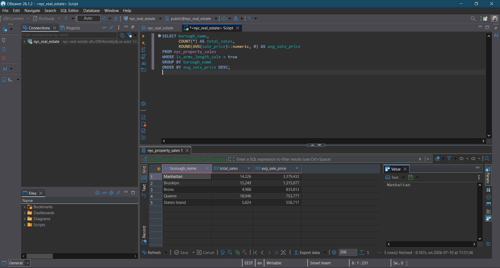
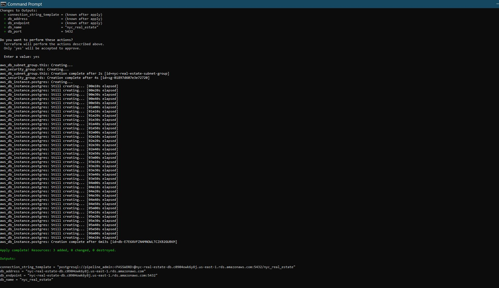
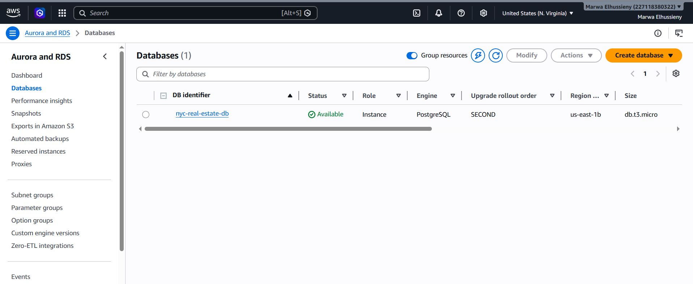
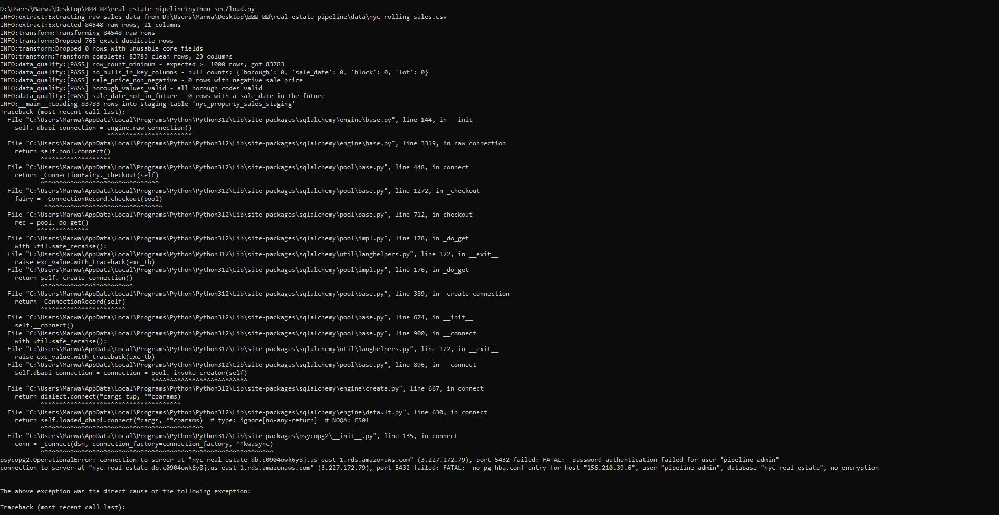

# NYC Real Estate Sales Pipeline

An end-to-end batch data pipeline that extracts NYC Department of Finance
property sales data, cleans and validates it, and loads it into a Postgres
database provisioned on AWS RDS via Terraform, orchestrated with Airflow.

## Why this project

Most junior "real estate ETL" portfolio pieces stop at a Jupyter notebook and
a local CSV. This one is built the way a small data team would actually run
it in production:

- **Infrastructure is code, not a console click.** The RDS Postgres instance
  is provisioned with Terraform, not created by hand in the AWS console.
- **The messy parts of the data are handled, not hidden.** The raw source
  export has string placeholders instead of nulls, duplicate rows, and $0
  "sales" that are really family/estate transfers. The transform layer deals
  with all of it explicitly (see [`src/transform.py`](src/transform.py)).
- **Bad data fails the pipeline loudly.** A dependency-free data-quality gate
  runs between transform and load and raises a specific, named failure
  (`row_count_minimum`, `sale_price_non_negative`, etc.) rather than silently
  loading garbage.
- **The load is idempotent.** Each run stages data into a `_staging` table
  and atomically swaps it into place, so a failed run never leaves the
  target table half-written.

## Architecture

## Architecture


## Dataset

[NYC Department of Finance – Rolling Sales Data](https://www.nyc.gov/site/finance/property/property-rolling-sales-data.page):
~84,500 property sale records across all 5 boroughs, published on NYC Open
Data. A 500-row sample is committed at `data/nyc-rolling-sales-sample.csv`
for quick local testing; the full file is gitignored (13MB) — see
[`data/README.md`](data/README.md) for how to fetch it.

Known data quality issues handled explicitly in `transform.py`:
| Issue | Handling |
|---|---|
| `SALE PRICE`, `LAND SQUARE FEET`, `GROSS SQUARE FEET` arrive as strings with `" -  "` placeholders | Parsed to proper nullable floats |
| ~765 exact duplicate rows in the raw export | Dropped |
| $0 / nominal-dollar "sales" (family transfers, estate settlements) | Flagged via `is_arms_length_sale`, **not dropped** — dropping them would misrepresent what's actually in the source |
| `YEAR BUILT` has some clearly invalid values (0, etc.) | Bounded to a sane range, invalid values set to null |

## Stack

| Layer | Tool |
|---|---|
| Orchestration | Apache Airflow (TaskFlow API) |
| Transformation | pandas |
| Storage | PostgreSQL on AWS RDS (free tier: `db.t3.micro`) |
| Infrastructure as Code | Terraform |
| CI | GitHub Actions (pytest + terraform validate) |
| Local dev | Docker Compose (Airflow standalone) |

## Repo structure

```
├── dags/nyc_real_estate_pipeline.py   # Airflow DAG
├── src/
│   ├── extract.py                     # Reads raw CSV (swap for live API later)
│   ├── transform.py                   # Cleans messy source data
│   ├── data_quality.py                # Named, fail-loud quality gate
│   └── load.py                        # Idempotent staging-swap load into Postgres
├── terraform/                         # RDS + security group + subnet group
├── tests/test_transform.py            # pytest suite, runs in CI
├── sql/schema.sql                     # Target table DDL (reference)
├── docker-compose.yml                 # Local Airflow for development
└── .github/workflows/ci.yml           # pytest + terraform validate on every push
```
## Evidence

runs against real, live infrastructure:

| | |
|---|---|
|  | Average sale price by borough, queried live from the RDS instance |
|  | `terraform apply` provisioning the real RDS instance |
|  | The instance visible in the AWS RDS console |
|  | Full extract → transform → quality gate → load run |
## Running it

### 1. Provision the database (Terraform)

```bash
cd terraform
cp terraform.tfvars.example terraform.tfvars
# edit terraform.tfvars: set allowed_cidr to `curl -s ifconfig.me`/32

export TF_VAR_db_password="choose-a-strong-password"

terraform init
terraform plan
terraform apply
```

This provisions a `db.t3.micro` Postgres 16 instance in your account's
default VPC, with a security group that only allows inbound traffic on 5432
from the IP you specify — free-tier eligible (750 hrs/month for 12 months),
but **remember to `terraform destroy` when you're done** so it doesn't run
past the free tier window.

Grab the connection details:
```bash
terraform output connection_string_template
```

### 2. Run the pipeline locally against RDS

```bash
pip install -r requirements.txt
export DB_CONN_STRING="postgresql://pipeline_admin:<password>@<rds-endpoint>:5432/nyc_real_estate"

python src/load.py   # runs extract -> transform -> quality gate -> load
```

### 3. Or run it under Airflow

```bash
echo "DB_CONN_STRING=postgresql://pipeline_admin:<password>@<rds-endpoint>:5432/nyc_real_estate" > .env
docker compose up airflow-init
docker compose up
```
Airflow UI: http://localhost:8080 (admin/admin). Trigger `nyc_real_estate_pipeline`.

### 4. Tests

```bash
pytest tests/ -v
```

## Tearing down

```bash
cd terraform
terraform destroy
```

## What I'd add with more time

- dbt models on top of the raw loaded table for a proper staging/marts split
- Great Expectations instead of the hand-rolled quality gate, for a richer
  data docs site
- A small Streamlit/Evidence dashboard on top of the RDS table

---
*Built as part of a modernized 10-project data engineering portfolio, upgrading
the original brief from [garage-education/data-engineering-projects](https://github.com/garage-education/data-engineering-projects).*
